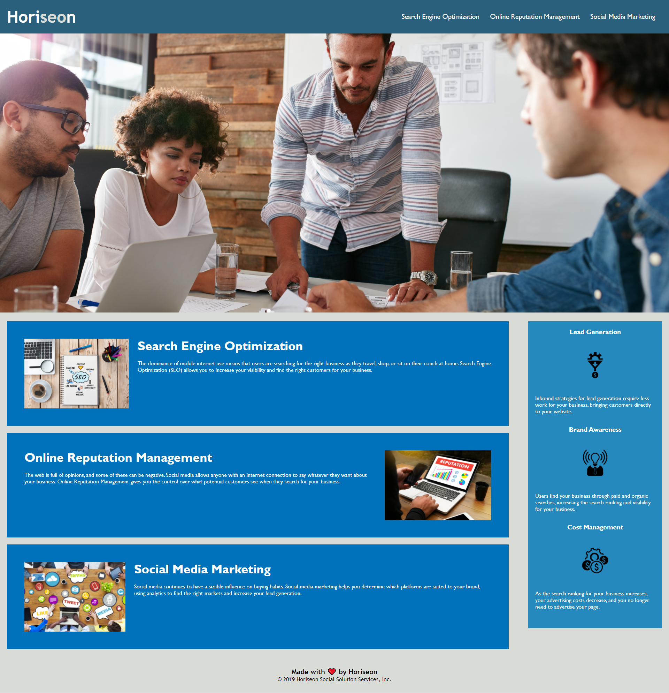

# Code Refactor Starter Code

## Summary:

In this refactor I altered almost every div into a semantic HTML element applying section and article which will aloow screen readers to provide more detail the sections being read out loud.
After applying semantic HTML I moved on to swap out the 'divs' from CSS to the semantic HTML tags to keep the flow and style of the page as intended in the mock-up.
I was also able to take out multiple repetitive CSS rules and condense them with the site still looking like the mock-up.

## Languages Used:
* HTML
* CSS 

## Live URL
[https://diegorivera1110.github.io/refactored-horiseon-accessibility/](https://diegorivera1110.github.io/refactored-horiseon-accessibility)

##  Screenshot

## Credits

Screenshot provided through the help of Google Chrome Extension Nimbus Capture. https://nimbusweb.me/screenshot.php